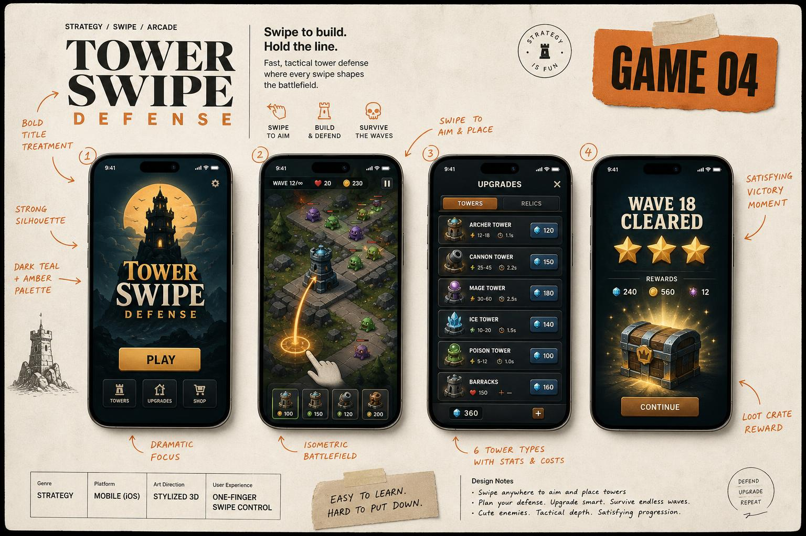

# Tower Swipe Defense

> **Swipe to Defend Your Tower!** — egyszerű húzás-és-elenged célzással védd a tornyodat hullámról hullámra.

## Koncepció

A képernyő közepén egy tornyod áll. Az ellenfelek hullámokban közelednek 8 irányból. A játékos **húzza ujját a torony irányából kifelé**, mint egy csúzlit — a húzás iránya és hossza adja meg a lövedék célját és erejét. Elenged → lő. Az ellenségek megölése coint ad, amiből torony-szinteket vásárolsz (DMG, fire-rate, range, area, slow, multi-shot). 50 wave után boss-fight; végtelen mód is van.

## Hogyan kell játszani

1. **Drag a toronyról kifelé** → célzás.
2. **Elenged** → kilő egy varázs-projektilt (vagy nyilat, golyót — skin függő).
3. Pusztítsd el az ellenségeket → coin drop.
4. **Wave közti shop** → upgrade vagy heal vagy új ability.
5. **Survive** a legtöbb wave-ig.

## Kulcs jellemzők

- 7 ellenség-típus: grunt, runner, tank, healer, ranged, boss-mini, boss.
- 12 upgrade-fa node (DMG, fire-rate, multi-shot, slow-aura, freeze, fire-bullets, lightning, …).
- 5 torony-skin (stone, ice, jungle, volcano, crystal) + saját ability.
- Boss-wave minden 10. fordulóban + epic loot drop.
- Replay & ghost record megosztása.
- Endless + Daily Challenge mód.

## Core loop

`Aim → Shoot → Earn → Upgrade → Survive → Repeat`

Egy session 3–8 perc, a játékos magasabb wave-re tör.

## Képernyő-tervek (5 mockup)

| # | Képernyő | Tartalom |
|---|----------|----------|
| 1 | **Main Menu** | Tornyot ábrázoló izometrikus jelenet, `PLAY`, `UPGRADES`, `SKINS`, `DAILY` gombok. |
| 2 | **Gameplay early** | Egyszerű mező, kis tornyok, néhány ellenség, slingshot-aim guide (íjsugár). |
| 3 | **Mid-wave** | Wave 26, sok ellenség, robbanások, tűz, screen flash. |
| 4 | **Wave Complete / Shop** | Modal: 3 upgrade választás (random kínálatból), reroll gomb (rewarded ad). |
| 5 | **Victory** | „WAVE 50" arany felirat, csillag-rating, reward 1000 coin + 50 gem. |

## Progresszió és nehézség

- **Wave w HP:** alap `H(w) = 10 · (1.08)^w` per ellenség, count `N(w) = 5 + floor(w/3)`.
- **Coin drop:** `D(w) = 2 · (1.05)^w` per kill.
- **Boss-wave** (`w % 10 == 0`): 1 darab `H_boss = N(w) · H(w) · 4`.
- **Upgrade ár:** `P(t) = base · (1.5)^t`, t = adott upgrade szintje.
- **DDA:** ha 3× elbukik W=X-en, X+1-re indul kompenzáló bónusz: `+15% DMG, −10% enemy HP` 1 wave-ig.

## Monetizáció

- **Rewarded:** `Revive` (1×/run), `2x coin`, `Reroll shop`, `Daily free skin spin`.
- **IAP:** Coin pack 0.99–49.99, `Premium Skin Bundle 4.99`, `No-ads 3.99`, `Battle Pass 9.99/szezon`.
- **Interstitial:** csak Game Over screen után, capping 90 sec.

## Tech specs (MVP)

- React + PixiJS (2D top-down) + Zustand + spatial hash collision.
- 60 FPS target, <50 entity szimultán.
- Backend: Lovable Cloud — leaderboard, daily seed, ghost-replay storage.
- App méret: < 40 MB.
- Dev idő: 5–7 hét.

## Miért fog sikerülni

- Slingshot-aim mechanika **viszketeti az ujjat** (high session).
- Roguelite-szerű random upgrade choice → minden run más.
- Daily Challenge seed → leaderboard versengés.
- Boss-fight share-clip generálás (auto-record top wave).
- Skin-economy → kozmetikai IAP nyitott monetizáció.

## Célközönség és piacok

- 12–35 év, mid-core casual.
- Top piacok: USA, UK, Németország, India, Délkelet-Ázsia.
- ASO: `tower`, `defense`, `swipe`, `archer`, `arcade`, `roguelike`.
